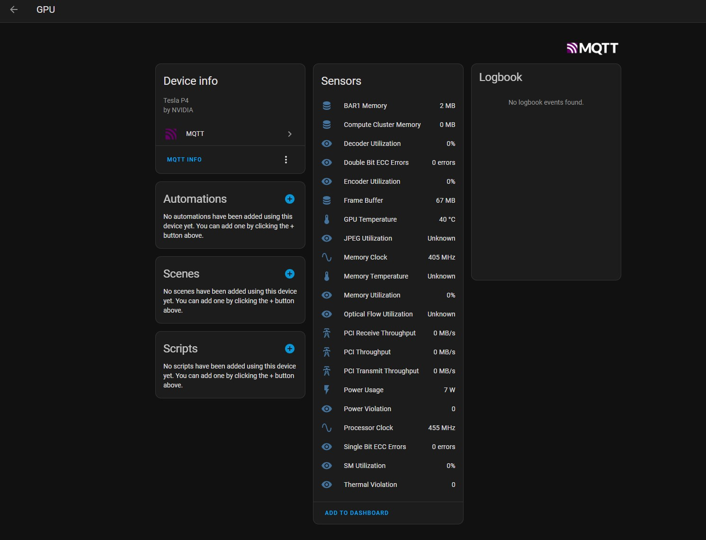

# NVidia Metrics to Home Assistant through MQTT

This project is a Python script that sends Nvidia GPU metrics to Home Assistant. It parses the output of the `nvidia-smi` command and uses Home Assistant's MQTT auto-discovery feature to register all GPUs. The service file will automatically install a virtual environment and the required package before execution. No root access is required.

## Features
- Sends Nvidia GPU metrics to Home Assistant
- Uses MQTT auto-discovery feature to register all GPUs
- Automatically installs a virtual environment and required package

## Requirements
- Nvidia GPU
- Home Assistant
- MQTT broker

## Installation
1. Clone the repository to `$HOME/nvidia-stat`
2. Register and start the service: `systemctl --user enable $HOME/nvidia-stat/nvidia-smi2ha.service`
3. To start it at logon, make the user "linger": `loginctl enable-linger`
4. Make a copy of the `.env.sample` file as `.env`
5. Edit the credentials for the MQTT connection in `.env`
6. Start the service: `systemctl --user start nvidia-smi2ha.service`

## Usage
After installation, the script will start sending GPU metrics to your Home Assistant instance. You can view these metrics in the Home Assistant dashboard.

## Troubleshooting
If you encounter any issues, please check the following:
- Ensure that the MQTT broker is running and accessible
- Check the `.env` file for any errors in the MQTT credentials

## Contributing
We welcome contributions! Please see the issues section for current tasks.

## License
This project is licensed under the MIT License.

## TODO
 - [ ] Code cleanup
 - [ ] Refactor to multiple files
 - [ ] Add configurable topics for the state updates and the HA sensor config